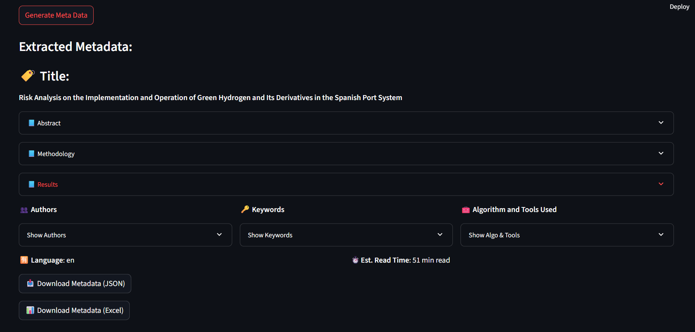

# Automated Meta Data Generator

This project automatically extracts structured metadata from academic PDFs, reasearch papers, scanned documents, and technical reports using both direct text parsing and OCR layout analysis. It supports intelligent title detection, section segmentation, and keyword extraction, all presented through a user-friendly *Streamlit web app*.

# Features

- Supports both digitally readable and scanned PDFs
- Extracts abstract, keywords, authors, methodology, results, and conclusion
- Automatically distinguishes scanned PDFs
- OCR-based layout-aware title extraction (bounding box + height logic)
- Structured metadata in JSON + Excel
- Stylized Streamlit UI for document upload and preview

## Streamlit App Demo



> Upload a file, extract structured insights, download JSON or Excel in seconds.

---

## Project Structure

```
metadata_generator/
├── data/                   # Sample PDFs
├── utils/
│   ├── extract_text.py     # Extract text from PDF, DOCX, TXT
│   ├── ocr_utils.py        # OCR logic, layout blocks, title logic
│   └── metadata_utils.py   # Full metadata generation pipeline
├── webapp/
│   └── app.py              # Streamlit interface
├── test_title.py           # Script to test OCR title logic
├── requirements.txt        # Dependencies
└── README.md
```

---

## Installation
    Creating Virtual Environment
```bash
git clone https://github.com/yourusername/metadata_generator.git
cd metadata_generator
python -m venv venv
venv\Scripts\activate      # On Windows
pip install -r requirements.txt
```

### System Requirements

- [Tesseract OCR](https://github.com/tesseract-ocr/tesseract) (add to PATH)
- [Poppler](http://blog.alivate.com.au/poppler-windows/) (for PDF to image conversion)

---

## Usage

```bash
streamlit run webapp/app.py
```

Then open your browser at `http://localhost:8501`.

---

## Sample Output

```json
{
  "title": "Functions of Production Planning and Control",
  "abstract": "In this paper, we examine...",
  "keywords": ["planning", "control", "supply chain"],
  "authors": ["M. Sharma", "A. Roy"],
  "methodology": "Multi-objective optimization model...",
  "results": "...",
  "language": "en"
}
```

---

## Key considerations
- Forced OCR scanning in case of mixed type documents.
- Numerous possible ways for title extraction of standard complex documents.
- Read time, Language detection of the documents.
- User friendly presentation of the generated Metadata

## Future Scope

- integrating OCR support to the Streamlit app interface
- enabling better accuracy in extracting semantic features
- Deploy to Streamlit Cloud with upload history
---

## Author

Sumit Kumar Rohan
B.Tech in Production and Industrial Engineering 
IIT Roorkee
